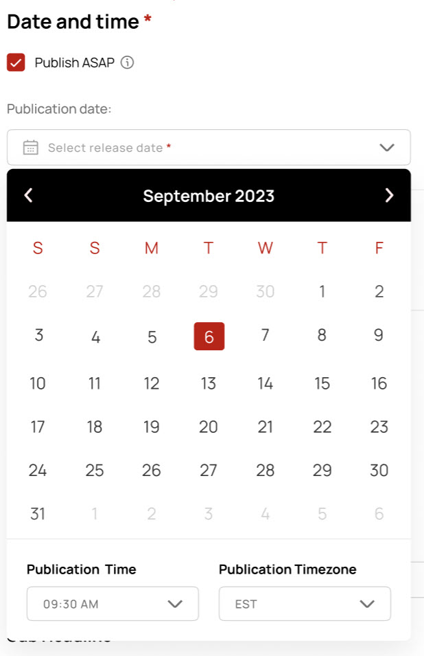

# Date Picker test
[Demo Link](https://65c32f3baac6134ac844c626--neon-dusk-4851f1.netlify.app/)

## Task description

- Clicking on the "Publication date" field opens a popup with a calendar below it.
- The default view of the calendar displays the current month and date.
- Below the calendar, users can select the publication time and timezone.
- Publication time dropdown lists times from 9 AM to 5 PM in 30-minute intervals.
- Publication timezone dropdown provides choices for EST and UTC.
- Upon selecting a date, the date picker closes automatically and updates the field with the chosen date, time, and timezone in the format DD/MM/YYYY HH:MM AM/PM (TIMEZONE).

## Design
